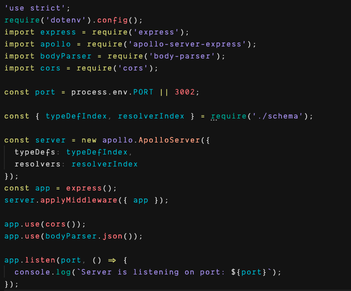
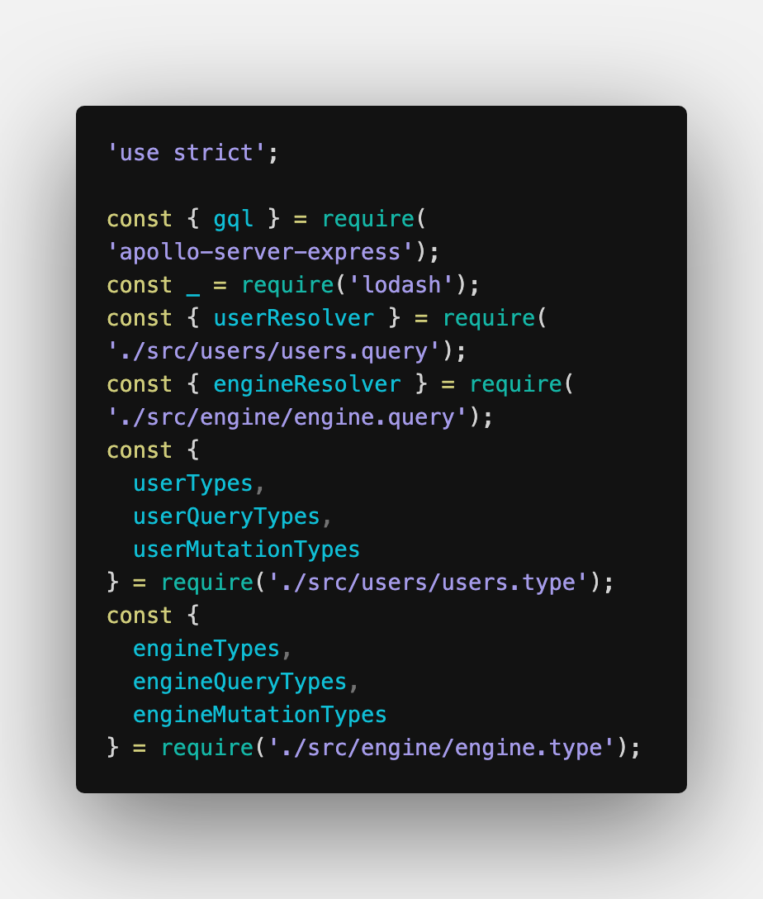
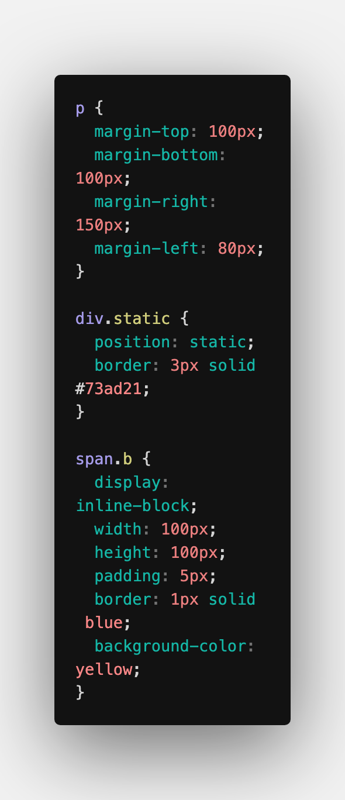
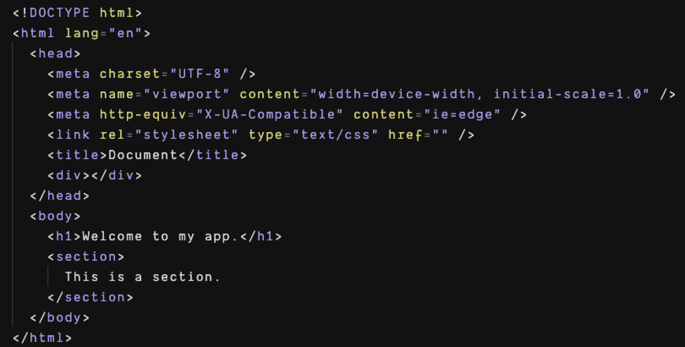
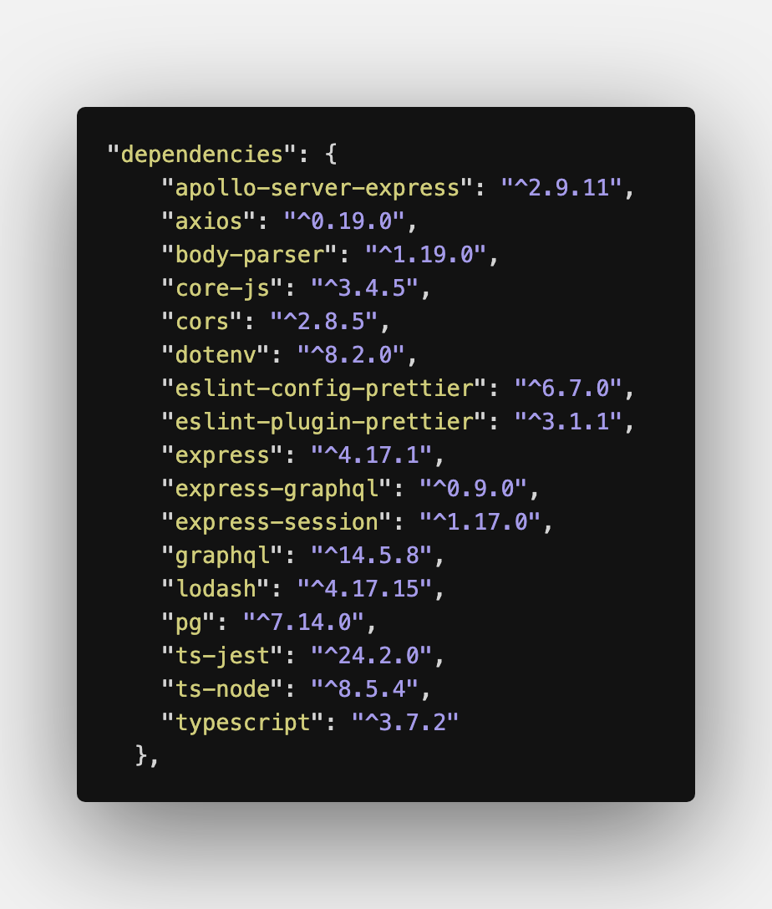

# Ukiyo

A VS Code theme designed with a balanced color palette to be easy on the eyes and provide functional syntax highlighting.

Also includes support for italics on reserved keywords and function names.

## JavaScript

## CSS

## HTML

## JSON

