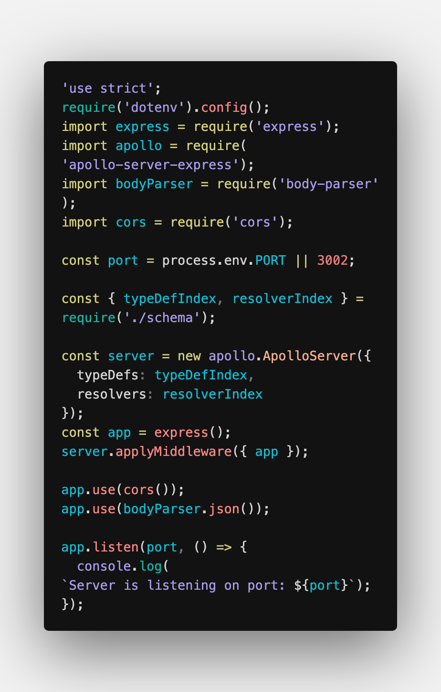

# Ukiyo

A VS Code theme designed with a balanced color palette to be easy on the eyes and provide functional syntax highlighting.

Also includes support for italics on reserved keywords and function names.

## Recommended Fonts

I have no affiliation to the following, other than that I enjoy using them and think they work especially well with this theme:

- [Dank Mono](https://dank.sh/): A font with support for italics that costs around \$40
- [JetBrains Mono](https://www.jetbrains.com/lp/mono/): A new free open source font from Jetbrains with nice ligatures

## JavaScript

## CSS

## HTML

## JSON

## Contributions

Feel free to create an issue or a PR if you see ways to improve this theme: [Github Link](https://www.github.com/zcericola/ukiyo-theme)

This was my first shot at making one so I will continue to update and tweak it as needed.
